# UE5.7 Material System Analysis

## Document Goal

这份文档不是“材质节点手册”，而是对 Unreal Engine 5.7 材质系统的系统级分析。

目标有三个：

1. 帮你建立 UE5.7 材质系统的完整心智模型。
2. 帮你看清“材质图 -> HLSL -> ShaderMap -> 运行时参数更新”的完整链路。
3. 帮你区分 UE5.7 里仍然共存的三套思路：
   - 传统 Main Material Node + 固定 Shading Model
   - Material Functions / Layered Materials / Material Layers
   - Substrate

本文基于两类信息整理：

- 官方文档与 UE5.7 Release Notes
- 本地引擎源码 `UE 5.7.4`

---

## Executive Summary

如果只看最重要的结论，UE5.7 材质系统可以概括成下面几句话：

1. UE 材质不是“一个 shader 文件”，而是一整套资产、图编译器、参数系统、ShaderMap 缓存系统和渲染路径适配系统。
2. `UMaterial` 是“定义”，`UMaterialInstance` 是“继承与覆盖”，`UMaterialInstanceDynamic` 是“运行时可写实例”。
3. Main Material Node 的可用输入并不是固定的，它受 `Material Domain`、`Blend Mode`、`Shading Model` 共同控制。
4. 图里的每个 `UMaterialExpression` 最终都会经由 `FMaterialCompiler` 编译成中间表示，再生成 HLSL，最后进入 `FMaterialShaderMap` 编译和缓存。
5. UE5.7 的大变化是 `Substrate` 正式进入生产可用并默认开启，但传统材质系统并没有消失，二者处于并存状态。
6. 在本地 `UE 5.7.4` 源码里，Substrate 开启时，材质翻译仍会回退到 legacy translator；新的 IR/HLSL generator 路径当前不支持 Substrate。
7. 真正决定材质成本的，通常不是基础算术，而是纹理采样数、透明 overdraw、场景纹理读取、距离场查询、WPO、复杂分层和 permutation 数量。

---

## 1. What "Material System" Actually Means In UE

很多人把材质系统理解成“材质编辑器 + 节点图”，这只覆盖了最上层。

UE5.7 的材质系统更准确地说，是下面这几层共同组成的：

1. 资产层
   - `UMaterial`
   - `UMaterialInstance`
   - `UMaterialInstanceConstant`
   - `UMaterialInstanceDynamic`
   - `UMaterialFunction`
   - `UMaterialParameterCollection`
   - Material Layer / Material Layer Blend 资产

2. 图表达层
   - `UMaterialExpression` 及其数百个子类
   - Main Material Node
   - Material Attributes
   - Substrate BSDF / Operator 节点

3. 编译层
   - `FMaterialCompiler`
   - `FHLSLMaterialTranslator`
   - 新的 Material IR / HLSL generator 路径
   - `/Engine/Generated/Material.ush`

4. shader 资源层
   - `FMaterial`
   - `FMaterialResource`
   - `FMaterialRenderProxy`
   - `FMaterialShaderMap`

5. 运行时参数层
   - 实例参数覆盖
   - MID 动态改参
   - Material Parameter Collection 全局参数
   - Sequencer / Blueprint / Niagara / Movie Render Graph 驱动

6. 渲染路径适配层
   - Surface / Decal / Volume / Post Process / UI 等 Domain
   - Opaque / Masked / Translucent 等 Blend Mode
   - Default Lit / Hair / Eye / SingleLayerWater / Substrate 等 Shading Model
   - Deferred / Forward / Path Tracing / Ray Tracing / Mobile / Nanite / Lumen / VT 适配

所以“材质系统”本质上是一个图形化材质 DSL，加上一个面向多平台、多渲染路径的 shader 生成与缓存框架。

---

## 2. UE5.7 的关键变化

### 2.1 最大变化：Substrate 进入默认主线

UE5.7 Release Notes 明确写到：

- `Substrate materials` 在 UE5.7 中已经是 `production-ready`
- 并且 `enabled by default`

这意味着：

- UE5.7 之后，Substrate 不再只是一个实验性旁路
- 它已经进入主材质系统主线
- 后续材质框架的长期演进方向，基本会围绕它展开

### 2.2 但官方文档仍存在“旧口径残留”

官方 `Substrate Materials` 总览页的搜索摘要里仍然出现了 “Beta feature, use caution when shipping” 的措辞。

这说明文档页面和 Release Notes 存在口径不同步。

这里更可信的判断是：

- 对“版本状态”的结论，以 `UE5.7 Release Notes` 为准
- 对“怎么用”的具体说明，仍然可以参考 Substrate 文档页

这是一个重要的版本阅读习惯。

### 2.3 本地源码里的直接证据

本地引擎源码 `Engine/Build/Build.version` 显示当前工作区版本是：

- `MajorVersion: 5`
- `MinorVersion: 7`
- `PatchVersion: 4`

也就是 `UE 5.7.4`。

并且在本地源码中可以直接看到：

- `UMaterial` 持有 `FrontMaterial`
- `UMaterial` 里有 `SubstrateConversionVersion`
- `UMaterial` 里有 `SubstrateVersion`
- `EngineTypes.h` 里仍保留 `MSM_Strata`，显示名为 `Substrate`

这说明 Substrate 已经不是外挂式扩展，而是深度嵌入到主材质结构和编译链中的一等公民。

---

## 3. The Asset Model

### 3.1 UMaterialInterface 是共同基类

对运行时和渲染器来说，很多时候并不关心你手上拿的是基础材质还是实例。
它更关心的是“能不能提供材质编译结果、参数、render proxy”。

这也是为什么许多 API 接口都以 `UMaterialInterface*` 为中心。

### 3.2 UMaterial 是源定义

`UMaterial` 是真正存节点图和属性配置的资产。

它负责定义：

- Material Domain
- Blend Mode
- Shading Model
- 是否使用 Material Attributes
- 所有表达式图
- Substrate Front Material
- 各材质输入的默认值和连接关系

从源码看，`UMaterial::CompilePropertyEx()` 会根据不同的 `Material Property`，去编译对应输入。

如果启用了 `bUseMaterialAttributes`，多数属性会直接走 `MaterialAttributes.CompileWithDefault(...)`。

这意味着：

- “Use Material Attributes” 不只是编辑器层面的视觉简化
- 它实际上改变了图的编译入口

### 3.3 UMaterialInstance 是继承层

`UMaterialInstance` 的核心意义是：

- 继承父材质 shader 结构
- 只覆盖参数和静态分支配置

本地源码中，`UMaterialInstance::CompilePropertyEx()` 直接委托给 `Parent->CompilePropertyEx(...)`。

这条链非常关键，因为它说明：

- 实例本身通常不重新定义图结构
- 它更多是在“父材质定义的图和编译框架”之上做覆盖

### 3.4 MIC 和 MID 的职责区别

#### Material Instance Constant

适合：

- 美术调参
- 静态参数选择
- 长生命周期资产变体

特点：

- 编辑器友好
- 不适合频繁实时写入

#### Material Instance Dynamic

适合：

- 游戏运行时改参
- 蓝图和代码驱动动态效果
- UI、角色状态、命中特效、时间推进等

在 `UMaterialInstanceDynamic` 里能看到大量 `SetScalarParameterValue`、`SetVectorParameterValue`、`SetTextureParameterValue`、`ByInfo` 版本和按 index 的优化版本。

这意味着 MID 的设计目标非常明确：

- 允许你在运行时高频改参数
- 并为高频场景提供参数索引缓存接口

### 3.5 Material Parameter Collection 是全局参数系统

`UMaterialParameterCollection` 是另一条并行参数系统，它不是某个单材质的子对象，而是独立资产。

它的定位是：

- 让多个材质共享一组全局参数
- 并能在运行时统一更新

本地源码头文件说明得很直接：

- “any number of materials can reference these parameters and get new values when the parameter values are changed”

官方参数表达式文档还提到一个很实用的限制：

- 一个材质最多引用 `2` 个不同的 Material Parameter Collection

实战上通常建议：

- 一个做“游戏全局”
- 一个做“关卡或局部系统”

---

## 4. The Semantic Core: Domain, Blend Mode, Shading Model

Main Material Node 可用哪些输入，不是固定死的。
UE 的材质语义空间主要由三组枚举决定：

- `Material Domain`
- `Blend Mode`
- `Shading Model`

这三者共同决定：

- 哪些输入引脚可用
- 这份材质会在哪个渲染阶段被消费
- 生成哪些 shader permutation
- 允许哪些渲染特性

### 4.1 Material Domain

本地 `MaterialDomain.h` 定义了这些 Domain：

| Domain | 用途 | 说明 |
|---|---|---|
| `MD_Surface` | 普通表面材质 | 最常用，静态网格、骨骼网格、场景表面 |
| `MD_DeferredDecal` | 延迟贴花 | 投射到 GBuffer / decal frustum |
| `MD_LightFunction` | 灯光函数 | 描述灯的分布 |
| `MD_Volume` | 体积材质 | 体积效果、介质 |
| `MD_PostProcess` | 后处理材质 | 自定义后处理 pass |
| `MD_UI` | UI / Slate / UMG | 2D 界面材质 |
| `MD_RuntimeVirtualTexture` | 已废弃 | 现在通过显式 RVT Output 节点替代 |

一个很值得记住的源码细节：

在 `UMaterial::BackwardsCompatibilityVirtualTextureOutputConversion()` 里，旧的 `MD_RuntimeVirtualTexture` 支持会被转换为：

- `MD_Surface`
- 外加显式的 `UMaterialExpressionRuntimeVirtualTextureOutput`

这意味着在 5.7 主线里，RVT 输出更像是“Surface 材质中的特定输出节点”，而不是单独 domain 工作流。

### 4.2 Blend Mode

本地 `EngineTypes.h` 中定义的 Blend Mode 包括：

| Blend Mode | 用途 |
|---|---|
| `Opaque` | 不透明，最便宜，也是默认主路径 |
| `Masked` | 二值裁切，适合树叶、铁丝网、洞口 |
| `Translucent` | 半透明，功能强但贵 |
| `Additive` | 累加，特效常用 |
| `Modulate` | 调制 |
| `AlphaComposite` | 预乘 Alpha |
| `AlphaHoldout` | 打孔式 Alpha |
| `TranslucentColoredTransmittance` | Substrate 专用半透明模式 |

性能层面最重要的判断是：

- `Opaque` / `Masked` 是主战场
- `Translucent` 是最容易失控的成本区

### 4.3 Shading Model

本地 `EngineTypes.h` 中仍然保留完整传统 Shading Model 集合：

- `Unlit`
- `Default Lit`
- `Subsurface`
- `Preintegrated Skin`
- `Clear Coat`
- `Subsurface Profile`
- `Two Sided Foliage`
- `Hair`
- `Cloth`
- `Eye`
- `SingleLayerWater`
- `Thin Translucent`
- `From Material Expression`
- 以及内部隐藏的 `MSM_Strata` / `Substrate`

你可以把 UE5.7 的材质系统理解成：

- 传统固定 shading model 仍然全面可用
- Substrate 在架构上开始接管“复杂真实材质表达”的未来方向

### 4.4 From Material Expression 的意义

`From Material Expression` 是传统系统里很重要但经常被低估的高级能力。

它允许：

- 在单个材质内按图逻辑选择不同 shading model
- 让一个材质局部使用不同的材质响应

官方文档明确说明，这可以减少材质数量和 draw calls。

它的本质不是“另一种 shading model”，而是把 shading model 的选择权部分下放到图逻辑里。

---

## 5. Main Material Node And Material Inputs

Main Material Node 是图的终点，但不是系统的起点。

更准确地说，它是：

- 图表达层和材质语义层的交汇点

官方文档对它的关键结论有两条：

1. Main Material Node 的输入是否启用，受 `Material Domain`、`Blend Mode`、`Shading Model` 控制。
2. 没有连接的输入，不是“不存在”，而是回退到默认值。

例如默认 PBR 路径里最常见的基础输入有：

- `Base Color`
- `Metallic`
- `Specular`
- `Roughness`
- `Normal`
- `Ambient Occlusion`
- `Emissive`

其他输入是否出现，取决于模式，例如：

- Translucent 才启用 `Opacity` / `Refraction`
- Masked 启用 `Opacity Mask`
- Hair / Eye / Cloth / Clear Coat 会打开额外的 `Custom Data`
- `From Material Expression` 会启用 `Shading Model`
- 使用 Substrate 时会强调 `Front Material`

在系统层面，Main Material Node 不是“美术面板”，而是一个“材质属性输出总线”。

---

## 6. The Graph Model

### 6.1 节点是 UObject，不是纯语法糖

每个材质节点本质上都是 `UMaterialExpression` 的子类。

它们具备：

- 输入输出定义
- 编辑器展示信息
- 编译逻辑
- 有时还具备 Substrate 语义能力

最关键的方法是：

- `Compile(FMaterialCompiler*, OutputIndex)`

也就是说，节点图不是先被序列化成某种“文本 DSL”再一次性解析。
相反，它更像一棵对象图，每个节点自己知道如何向 `FMaterialCompiler` 发出代码生成请求。

### 6.2 Material Attributes 是图结构组织手段

`MakeMaterialAttributes`、`SetMaterialAttributes`、`BreakMaterialAttributes`、`GetMaterialAttributes` 的意义不是“只是少拉几根线”。

它们真正解决的是：

- 让图按“整套材质属性”而不是单个 pin 组织
- 让 layered material、material functions、material layers、Substrate 前后材质流更可组合

如果把材质图类比成程序：

- 单 pin 连线更像写“散装过程式代码”
- Material Attributes 更像传递一个结构体

---

## 7. Compilation Pipeline

这是理解 UE 材质系统最关键的一节。

### 7.1 高层流程

```mermaid
flowchart LR
    A["UMaterial / UMaterialInstance"] --> B["Material Graph / Main Material Node"]
    B --> C["UMaterial::CompilePropertyEx"]
    C --> D["UMaterialExpression::Compile via FMaterialCompiler"]
    D --> E["Material Translator"]
    E --> F["/Engine/Generated/Material.ush"]
    F --> G["FMaterialShaderMap compile/cache"]
    G --> H["FMaterial / FMaterialResource / RenderProxy"]
    H --> I["Renderer draws with selected permutation"]
```

### 7.2 CompilePropertyEx 是属性级编译入口

在本地源码中：

- `UMaterial::CompilePropertyEx()` 根据 `AttributeID` / `MaterialProperty` 决定编译哪个输入
- 若 `bUseMaterialAttributes` 为真，则大部分属性直接改走 `MaterialAttributes.CompileWithDefault(...)`

这意味着材质编译不是“整张图直接一次性吐 shader”。
它首先是：

- 针对材质属性逐项建立编译入口

### 7.3 实例材质如何参与编译

`UMaterialInstance::CompilePropertyEx()` 在本地源码里直接委托给父材质：

- `return Parent ? Parent->CompilePropertyEx(...) : INDEX_NONE;`

这个设计说明实例系统的核心不是“重写图”，而是：

- 复用父图
- 叠加参数与静态配置

### 7.4 节点如何把图变成代码

每个 `UMaterialExpression` 子类都会在自己的 `Compile()` 里调用 `FMaterialCompiler` 的接口。

因此，材质图到代码的关系更像：

- 对象图递归遍历
- 每个节点贡献一个表达式或代码块
- 编译器记录类型、依赖、uniform expression、texture usage、scene texture usage 等元信息

### 7.5 旧 translator 与新 translator

在本地 `FMaterial::Translate()` 中，有一条非常重要的分支：

- 如果 shader map 设置了 `bUsingNewHLSLGenerator`
- 且 `Substrate` 没有启用
- 才走 `Translate_New()`
- 否则走 `Translate_Legacy()`

源码里的注释很明确：

- `the new translator does not support Substrate yet`

这条信息非常关键，因为它直接说明在 `UE 5.7.4` 里：

- 新的 Material IR / HLSL generator 已经存在
- 但 Substrate 材质仍绑定在 legacy translator 路径上

也就是说，UE5.7 的材质系统此时处在“架构迁移进行中”的阶段，而不是一次性替换完毕。

### 7.6 HLSL 最终如何落地

在本地 `Translate_Legacy()` 路径中可以看到：

- `FHLSLMaterialTranslator` 负责翻译图
- 翻译结果会生成 `MaterialShaderCode`
- 最后被塞进虚拟 include 路径：
  - `/Engine/Generated/Material.ush`

这个生成文件随后会被基础 shader 模板包含，例如 base pass shader。

也就是说，材质不是单独编译成一个完全孤立的 shader 文件，而是：

- 先生成一段材质专属 HLSL 片段
- 再注入到引擎 shader 模板体系里

### 7.7 ShaderMap 和缓存

`FMaterial::BeginCompileShaderMap()` 会：

1. 调用 `Translate()`
2. 生成 material compilation output
3. 准备 shader compiler environment
4. 触发 `FMaterialShaderMap` 编译与缓存

本地 `FHLSLMaterialTranslator::Translate()` 里还能看到 DDC 查询逻辑。

这意味着材质编译并不是单纯“每次重新跑一遍”，而是显式依赖：

- DDC
- ShaderMap ID
- 静态参数集
- 平台、Feature Level、Quality Level
- Substrate compilation config

所以所谓“材质编译慢”，本质上常常是：

- permutation 多
- 静态开关太多
- 目标平台多
- shader map key 不稳定

---

## 8. Runtime Representation

从编辑器资产到渲染器消费之间，还有一层很重要的运行时表示。

### 8.1 FMaterial

`FMaterial` 是运行时材质资源的核心抽象，负责：

- 与 ShaderMap 交互
- 参与编译和缓存
- 暴露渲染所需语义，如 Blend Mode、Shading Model、Material Domain

### 8.2 FMaterialResource

它更贴近某个平台 / Feature Level / Quality Level 的实际编译结果。

你可以把它理解成：

- 某一份材质定义在某种编译上下文下的具体资源版本

### 8.3 FMaterialRenderProxy

RenderProxy 负责把“材质资源 + 参数覆盖”交给渲染线程。

它解决的是：

- 渲染器不能直接碰 UObject 编辑状态
- 需要一个线程安全、渲染友好的代理层

这也是为什么运行时材质改参，从来不只是改 UObject 字段那么简单。

---

## 9. Parameter System

UE 材质系统的强大，很大一部分来自它的参数化能力。

### 9.1 参数分为三类

#### 普通参数

- `ScalarParameter`
- `VectorParameter`
- `TextureParameter`
- `RuntimeVirtualTextureParameter`
- `SparseVolumeTextureParameter`

用于：

- 单材质实例的局部覆盖

#### 静态参数

- `StaticSwitchParameter`
- `StaticBoolParameter`
- `StaticComponentMaskParameter`

用于：

- 编译时裁剪分支
- 但会增加 permutation 数量

#### 集合参数

- `CollectionParameter`
- Material Parameter Collection

用于：

- 跨材质共享全局状态

### 9.2 参数更新的不同成本

| 方式 | 是否重编译 | 典型用途 |
|---|---|---|
| 改普通材质图 | 会 | 修改母材质结构 |
| 改 Material Instance 普通参数 | 不会 | 美术调参与变体 |
| 改 MID 参数 | 不会 | 运行时动态效果 |
| 改 Static Switch 参数 | 常常需要重新编译对应 permutation | 架构分支 |
| 改 MPC 值 | 不会重编译，统一影响所有引用材质 | 全局状态驱动 |

### 9.3 为什么实例这么重要

官方文档明确强调实例材质的价值：

- 无需重新编译父 shader
- 更快的迭代反馈
- 更少的 shader 切换和总编译量

这里要精确理解：

- 实例不会让一个本来昂贵的 shader 变便宜
- 它优化的是“工作流”和“shader 资产组织与复用”

---

## 10. Material Functions, Layered Materials, And Material Layers

这是 UE 材质系统里最容易混淆的三套“复用 / 分层”能力。

### 10.1 Material Functions

Material Function 的定位是：

- 复用一段节点逻辑

它不是完整材质，也不能直接挂到网格上。
它更像“材质图里的函数”。

源码里 `UMaterialFunctionInterface` 明确把用途分成：

- `Default`
- `MaterialLayer`
- `MaterialLayerBlend`

所以 Material Function 实际上是后续图层系统的地基。

### 10.2 Layered Materials

传统 `Layered Materials` 工作流本质上是：

- 用 Material Function 定义各层
- 用 `Make/Break/Blend Material Attributes` 组合

这个模式的优点是：

- 足够灵活
- 逻辑清晰

缺点是：

- 参数要手动从基础材质往下传
- 实例化体验不够理想

### 10.3 Material Layers

Material Layers 是后来的更完整工作流。

它的核心思路是：

- Layer 资产和 Layer Blend 资产独立存在
- 基础材质中通过 `Material Attribute Layers` 表达式引用
- 材质实例编辑器里有专门的 Layer Parameters UI

这套系统的意义不是“功能更多”，而是：

- 把复杂分层材质从图级组织，升级为资产级组织和实例编辑器级组织

### 10.4 本地源码中的结构证据

`MaterialLayersFunctions.h` 中可以看到：

- `Layers`
- `Blends`
- `LayerStates`
- `LayerNames`
- `LayerGuids`
- `LayerLinkStates`

并且有用于 DDC / shader key 的 `FMaterialLayersFunctionsID`。

这说明 Material Layers 并不只是 UI 糖衣，它确实进入了 shader key 和编译标识体系。

### 10.5 什么时候用哪一套

| 场景 | 推荐方案 |
|---|---|
| 小范围复用一段数学或采样逻辑 | Material Function |
| 技术美术自己拼复杂 layered graph | 传统 Layered Materials |
| 希望美术在实例编辑器里高频换层调层 | Material Layers |
| 追求物理层级表达和未来主线架构 | Substrate |

---

## 11. Substrate In UE5.7

### 11.1 它到底替代了什么

官方对 Substrate 的定位是：

- 用更模块化、更物理一致的框架替代固定 shading model + blend mode 的组合表达

更直白一点讲：

- 旧系统更像“从预定义响应模型里选一个”
- Substrate 更像“按 BSDF 和操作符拼出响应模型”

### 11.2 本地源码中的结构变化

本地 `UMaterial` 里直接存在：

- `FrontMaterial`
- Substrate 相关版本字段
- Thin Surface / Roughness Tracking 等 Substrate 选项

而在 `UMaterialExpression` 基类里还能看到：

- `IsResultSubstrateMaterial`
- `GatherSubstrateMaterialInfo`
- `SubstrateGenerateMaterialTopologyTree`

这意味着 Substrate 不是传统图上“加几个新节点”这么简单，而是：

- 整个表达式系统被扩展成了能够识别“Substrate 材质流”的图

### 11.3 拓扑结构

官方 API 搜索结果和本地源码都表明：

- Substrate material 是一棵树
- `FrontMaterial` 是根
- BSDF 节点是叶子
- operator 节点在中间

这是一种非常关键的结构差异：

- 传统 Main Material Node 更像“固定属性槽输出”
- Substrate 更像“BSDF 组合树”

### 11.4 Substrate 节点输入告诉了我们什么

在本地 `MaterialExpressionSubstrate.h` 里，可以看到 `UMaterialExpressionSubstrateShadingModels` 直接持有：

- `BaseColor`
- `Metallic`
- `Specular`
- `Roughness`
- `Anisotropy`
- `EmissiveColor`
- `Normal`
- `Tangent`
- `ClearCoat`
- `ClearCoatRoughness`
- `Opacity`
- `TransmittanceColor`
- 水体散射 / 吸收参数
- `ShadingModel`

这说明 Substrate 并没有抛弃 PBR 基础量，而是：

- 把这些基础量重新组织到更底层、更可组合的 BSDF 框架里

### 11.5 5.7.4 一个很重要的工程现实

虽然 Substrate 已经在 5.7 中 production-ready 并默认启用，但本地 5.7.4 源码中仍可看到：

- 新 HLSL generator 路径不支持 Substrate
- Substrate 编译会回退到 legacy translator

这意味着：

- 架构方向已经定了
- 但底层编译器迁移尚未彻底完成

这是理解 UE5.7 材质系统成熟度的关键。

### 11.6 我对 Substrate 在 5.7 的实际判断

基于官方 Release Notes 和本地源码，我的判断是：

- 对“材质表达能力”来说，Substrate 已经进入可正式使用阶段
- 对“底层编译链彻底统一”来说，系统仍处于过渡态

这不是矛盾，而是大型引擎常见状态。

---

## 12. Renderer Integration

材质系统不是独立运行的，它最终必须适配具体渲染路径。

### 12.1 Surface 是主路径

大多数项目的绝大多数材质都应该落在：

- `MD_Surface`
- `Opaque` 或 `Masked`

因为这是：

- 特性最完整
- 性能最稳定
- 与 Nanite、Lumen、主 GBuffer 路径配合最自然的材质组合

### 12.2 Deferred Decal

Decal 材质不是“贴图换个投射方式”，而是单独的 domain。

这意味着：

- 它有不同的输入约束
- 它进入不同的 shader define 和渲染处理

### 12.3 Volume

Volume 材质服务的是体积渲染和介质表达。
它和 Surface 材质虽然共用一部分表达式系统，但语义完全不同。

### 12.4 Post Process

Post Process 材质是后处理中自定义图形逻辑的入口。

它常常会：

- 读取 SceneTexture
- 参与不同 Blendable Location
- 使用模板测试等额外属性

### 12.5 UI

`MD_UI` 是专门给 UMG / Slate 的材质域。

不要把普通 Surface 材质想当然地直接等同于 UI 材质，因为：

- 渲染上下文不同
- 支持的特性和期望成本也不同

---

## 13. Performance Model

UE 材质性能优化必须按“真正贵的东西”来思考。

### 13.1 主要成本来源

从项目经验和引擎结构看，主要成本一般来自：

- 纹理采样数量
- 透明 overdraw
- SceneTexture / SceneDepth 读取
- Distance Field 查询
- Procedural Noise / Vector Noise
- 大量 WPO
- 复杂 Layer / Substrate 组合
- Static Switch 带来的 permutation 爆炸

### 13.2 不同部分的成本本质

| 部分 | 成本本质 |
|---|---|
| 普通算术节点 | 大多是 ALU，通常不贵 |
| 纹理采样 | 带宽 + sampler + cache 压力 |
| SceneTexture | 读屏幕缓冲，常比普通采样更贵 |
| Translucency | overdraw + 排序 + 特殊路径 |
| WPO | 顶点成本，受顶点密度影响极大 |
| Static Switch | 运行时便宜，编译和 permutation 成本高 |
| Instances | 降低编译和切换压力，不直接降低单 shader 像素成本 |

### 13.3 Substrate 的成本思维

Substrate 的问题不是“能不能做”，而是“表达力会不会超出项目预算”。

它带来的典型风险包括：

- BSDF 层数过多
- 透明 / 透射材质复杂化
- 参数暴露和实例层级过深
- 对美术过于自由，导致图表和 permutation 失控

所以 Substrate 最适合：

- 有明确 look-dev 和物理材质目标的项目
- 愿意建立材质规范的团队

而不是“所有材质都一股脑换成最复杂 Substrate”。

---

## 14. Tooling And Debugging

UE 材质系统的调试工具也属于系统的一部分。

### 14.1 Material Editor 自带统计

第一层工具永远是：

- Material Editor 内的指令数、采样数、平台预览

### 14.2 Material Analyzer

官方提供了 `Material Analyzer` 工具，可用来：

- 分析项目中的材质和材质实例
- 找出子孙实例链
- 检查基础属性覆盖
- 检查 Static Switch 和 Static Component Mask 参数情况

这个工具很适合做：

- 母材质治理
- 实例爆炸排查
- 资产去重

### 14.3 5.7 的 shader debug 改进

UE5.7 Release Notes 里还提到材质相关调试改进，例如：

- 统一 ShaderDebugData 输出路径
- debug compile 机制整理
- cache hit 情况下也能输出对应调试产物

这说明 Epic 也在持续补材质编译可观察性。

### 14.4 实战排查顺序

我建议的顺序通常是：

1. 先看 Domain / Blend / Shading Model 是否选对
2. 再看采样数和透明路径
3. 再看静态分支数量
4. 再看实例链和参数组织
5. 最后才是节点级微优化

---

## 15. Recommended Project Architecture

如果让我从工程角度给 UE5.7 材质系统一套推荐架构，我会这样做：

### 15.1 母材质数量要少，但职责要清晰

建议按“渲染语义”而不是“美术资产名称”拆母材质：

- Surface Opaque Master
- Surface Masked Master
- Surface Translucent FX Master
- Character / Hair / Eye 专用母材质
- Decal Master
- Post Process Master
- UI Master

不要按：

- 石头一个母材质
- 木头一个母材质
- 铁一个母材质

这种拆法很快会爆炸。

### 15.2 参数命名规范必须先定

至少统一：

- `BaseColor_`
- `Roughness_`
- `Normal_`
- `Mask_`
- `UV_`
- `FX_`
- `Layer_`

否则 MID、Sequencer、Blueprint、Material Layers 很快会混乱。

### 15.3 把可运行时驱动的内容限制在普通参数和 MPC

不要让运行时逻辑依赖：

- 大量 static switch
- 改材质结构
- 频繁切父材质

### 15.4 Material Functions 用于“逻辑复用”

适合：

- UV 动画
- 常用 mask
- 法线处理
- 通用 Fresnel 包
- 雪、湿润、污渍等常用混合逻辑

### 15.5 Material Layers 用于“实例化分层工作流”

适合美术高频调层的内容：

- 角色皮肤表层脏污
- 武器漆层 / 划痕 / 烧灼
- 地表宏观 / 微观层次

### 15.6 Substrate 用于“高价值复杂材质”

我更建议把 Substrate 优先用在：

- Hero asset
- 高质量角色皮肤 / 头发 / 眼球
- 汽车漆、宝石、复杂涂层
- 高端 look-dev 资产

而不是直接全面替换整个项目所有材质。

---

## 16. Master Material And Function Architecture Handbook

这一节把前面的“推荐项目架构”进一步落到真正可执行的设计规则上。

很多项目材质体系后期失控，不是因为 shader 技术不够，而是因为：

- 母材质分层错误
- Function 复用边界不清
- 参数治理缺失
- 静态分支滥用

如果这几件事不先定下来，团队越大，材质系统越容易失控。

### 16.1 母材质按“渲染家族”拆，不按“美术名字”拆

优先按下面这种思路划分：

| 母材质家族 | 负责内容 | 不应该承担的内容 |
|---|---|---|
| Surface Opaque Master | 普通不透明表面 | 大量透明、后处理、特效逻辑 |
| Surface Masked Master | 植被、切孔、二值遮罩 | 大量半透明和复杂折射 |
| Surface Translucent FX Master | 能量体、雾、特效片 | 普通环境 props |
| Character Surface Master | 角色通用表面 | UI、post process、decal |
| Hair / Eye / Skin Hero Masters | 专项高价值材质 | 所有角色统一一套通吃 |
| Decal Master | 延迟贴花 | 一般表面材质逻辑 |
| Post Process Master | 后处理屏幕效果 | 普通 mesh surface |
| UI Master | UMG / Slate 材质 | world surface / decal |

拆错方向最常见的样子是：

- 石头一个母材质
- 木头一个母材质
- 金属一个母材质
- 然后每种再细分一堆近似变体

这种结构的后果是：

- 图重复
- 参数失控
- 编译成果重复
- 无法统一治理

### 16.2 什么时候该 fork 一个新的母材质

下面这几个条件满足任意两个时，通常就值得新开母材质：

1. Domain 不同
2. Blend Mode 家族不同
3. Shading Model 路径本质不同
4. 参数面板已经出现明显的两套人群
5. 需要的 static switches 已经形成独立分支簇
6. 运行时驱动模式完全不同

反过来说，如果只是：

- 贴图不同
- 若干 roughness 范围不同
- 几个特效参数不同

那往往更适合用实例，而不是新母材质。

### 16.3 Material Function 的职责边界

Material Function 最适合承载“逻辑片段”。

建议按下面几类组织：

| Function 类型 | 典型内容 |
|---|---|
| UV / coordinate | panner、rotator、world projection、triplanar weights |
| Mask generation | height mask、slope mask、radial mask、edge band |
| Normal utilities | flatten、blend、detail normal、reorient helpers |
| Surface response helpers | wetness、snow、dust、burn、moss |
| Utility math | remap、contrast、safe normalize、band shaping |
| Debug helpers | preview channels、debug colors、diagnostic outputs |

不建议把 Function 用成：

- 超长万能黑盒
- 把一整张完整材质都塞进去
- 依赖大量隐藏约定但不写说明

因为那样虽然复用了图，但可读性会迅速下降。

### 16.4 Material Layers 的使用边界

Material Layers 更适合：

- 美术实例化时要频繁替换层
- 角色和武器的表层变化
- 明确存在 layer asset / blend asset 工作流的项目

不适合：

- 只有一层或两层简单逻辑
- 团队还没有统一 layer 参数规范
- 功能需求本质上只是一个普通函数组合

最稳妥的原则是：

- Function 解决逻辑复用
- Layers 解决资产级分层复用

### 16.5 Substrate 母材质不要“宇宙统一”

Substrate 最大的工程风险不是不能做，而是太容易做成一个“什么都想支持”的宇宙母材质。

更推荐的做法是按表观家族拆：

- Hero Car Paint Master
- Hero Skin Master
- Hero Hair Master
- Gem / Transmittance Master
- Layered Surface Deposit Master

不要做：

- 一个 Substrate Master 同时处理车漆、皮肤、泥土、珠宝、头发、水体

那种图后期一定会在：

- 参数数量
- 编译复杂度
- look-dev 管理

三个方向同时失控。

### 16.6 参数治理规则

建议至少定下面四类命名：

| 前缀 | 用途 |
|---|---|
| `Base_` | 基础表面参数 |
| `Mask_` | 遮罩和混合参数 |
| `UV_` | UV / tiling / scrolling |
| `FX_` | 仅特效或时序驱动 |

如果是分层材质，还应该再加：

| 前缀 | 用途 |
|---|---|
| `Layer_` | layer 级参数 |
| `Blend_` | blend 级参数 |
| `Coat_` | clear coat / top layer |
| `Sub_` | substrate-specific grouped controls |

这不是格式洁癖，而是为了：

- MID 改参
- Sequencer 驱动
- Blueprint 可读性
- 实例面板可维护性

### 16.7 静态分支的治理原则

静态分支最容易被滥用。

建议只把它们用于真正的结构分歧：

- 是否启用 clear coat family
- 是否启用 expensive feature tier
- 是否走 mobile-safe path
- 是否切换某种 shading family

不建议用于：

- 小范围颜色差异
- 普通开关类 look-dev 参数
- 运行时频繁变化的状态

一句话总结：

- static switch 解决架构问题，不解决日常调参问题

### 16.8 一个推荐的项目级目录思路

一个比较稳的组织方式是：

| 目录 | 内容 |
|---|---|
| `Materials/Masters` | 母材质 |
| `Materials/Instances` | 直接实例 |
| `Materials/Functions` | 通用函数 |
| `Materials/Layers` | Material Layer 资产 |
| `Materials/LayerBlends` | Layer Blend 资产 |
| `Materials/Substrate` | Substrate 专项母材质和函数 |
| `Materials/Debug` | 调试材质与调试函数 |

### 16.9 设计评审时最该问的 8 个问题

1. 这个母材质是按渲染语义拆的吗？
2. 这个新需求真的需要新母材质吗？
3. 这个逻辑更适合 Function 还是 Layer？
4. 这里的 static switch 是结构分支还是偷懒开关？
5. 这组参数命名对实例、MID 和 Blueprint 友好吗？
6. 是否已经超过团队可维护的参数表规模？
7. 是否应该把高价值 Substrate 材质与普通资产分开？
8. 如果这个母材质坏了，会影响多少资产？

---

## 17. My Bottom-Line Reading Of UE5.7 Materials

如果要用一句话总结 UE5.7 材质系统：

它已经不是“传统材质系统 + 一点新节点”，而是一个处在架构升级过程中的双轨体系：

- 表层上，传统 Main Material Node 工作流依然完整可用
- 深层上，Substrate 已经成为未来主线
- 编译链上，新 IR / HLSL generator 在推进，但与 Substrate 还未完全统一

所以在 UE5.7 做材质开发，最成熟的工程策略不是“只押一边”，而是：

- 理解旧系统
- 有选择地引入 Substrate
- 把项目规范建在“参数化、复用、可观测、可裁剪”上

---

## 18. Current Study Set

目前这一组材质学习文档建议按下面顺序阅读：

1. `UE57_Material_System_Analysis.md`
   - 系统架构总览

2. `UE57_Material_Compile_Pipeline.md`
   - 从图到 HLSL 到 ShaderMap 的源码链路图解

3. `UE_Material_Node_Reference.md`
   - 节点类别、几何意义、实例和优化速查
   - 同时包含数学与空间入门，以及案例式 cookbook

4. `UE57_Substrate_Practical_Guide.md`
   - Substrate 的心智模型、节点家族、迁移策略和性能边界
   - 现已包含 `Substrate Cookbook`

5. `UE57_Material_Performance_Playbook.md`
   - 指令数、采样数、透明、WPO、场景纹理、Distance Field、Layering 和 Substrate 的专项优化
   - 现已包含 `Material Debugging Handbook`

---

## Source Map

### Official Documentation

- Unreal Engine 5.7 Release Notes  
  https://dev.epicgames.com/documentation/en-us/unreal-engine/unreal-engine-5-7-release-notes?application_version=5.7

- Material Inputs in Unreal Engine  
  https://dev.epicgames.com/documentation/it-it/unreal-engine/material-inputs-in-unreal-engine

- Physically Based Materials in Unreal Engine  
  https://dev.epicgames.com/documentation/unreal-engine/physically-based-materials-in-unreal-engine

- Create Materials and Material Instances  
  https://dev.epicgames.com/documentation/en-us/unreal-engine/artist-03-create-materials-and-material-instances

- Instanced Materials in Unreal Engine  
  https://dev.epicgames.com/documentation/fr-fr/unreal-engine/instanced-materials-in-unreal-engine

- Layered Materials in Unreal Engine  
  https://dev.epicgames.com/documentation/zh-cn/unreal-engine/layered-materials-in-unreal-engine

- Using Material Layers in Unreal Engine  
  https://dev.epicgames.com/documentation/zh-cn/unreal-engine/using-material-layers-in-unreal-engine

- From Material Expression Shading Model in Unreal Engine  
  https://dev.epicgames.com/documentation/zh-cn/unreal-engine/from-material-expression-shading-model-in-unreal-engine

- Material Parameter Expressions in Unreal Engine  
  https://dev.epicgames.com/documentation/de-de/unreal-engine/material-parameter-expressions-in-unreal-engine

- Material Analyzer  
  https://dev.epicgames.com/documentation/ja-jp/unreal-engine/unreal-engine-material-analyzer-tool

- Substrate Materials in Unreal Engine  
  https://dev.epicgames.com/documentation/es-mx/unreal-engine/substrate-materials-in-unreal-engine

### Local Engine Source

- `E:/Slash/Engine/Build/Build.version`
- `E:/Slash/Engine/Source/Runtime/Engine/Public/Materials/Material.h`
- `E:/Slash/Engine/Source/Runtime/Engine/Private/Materials/Material.cpp`
- `E:/Slash/Engine/Source/Runtime/Engine/Public/Materials/MaterialInstance.h`
- `E:/Slash/Engine/Source/Runtime/Engine/Private/Materials/MaterialInstance.cpp`
- `E:/Slash/Engine/Source/Runtime/Engine/Public/Materials/MaterialExpression.h`
- `E:/Slash/Engine/Source/Runtime/Engine/Public/Materials/MaterialExpressionSubstrate.h`
- `E:/Slash/Engine/Source/Runtime/Engine/Public/MaterialCompiler.h`
- `E:/Slash/Engine/Source/Runtime/Engine/Private/Materials/HLSLMaterialTranslator.cpp`
- `E:/Slash/Engine/Source/Runtime/Engine/Public/MaterialShared.h`
- `E:/Slash/Engine/Source/Runtime/Engine/Private/Materials/MaterialShared.cpp`
- `E:/Slash/Engine/Source/Runtime/Engine/Public/MaterialDomain.h`
- `E:/Slash/Engine/Source/Runtime/Engine/Public/Materials/MaterialLayersFunctions.h`
- `E:/Slash/Engine/Source/Runtime/Engine/Public/Materials/MaterialParameterCollection.h`
- `E:/Slash/Engine/Source/Runtime/Engine/Public/Materials/MaterialFunctionInterface.h`
