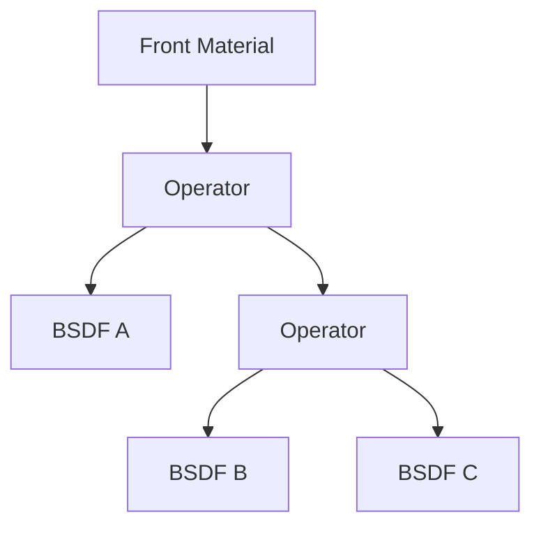

# UE5.7 Substrate Practical Guide

## Goal

这份文档专门回答四个问题：

1. `Substrate` 到底是什么。
2. 它和传统 UE 材质系统是什么关系。
3. UE5.7 里什么时候该用它，什么时候不该用。
4. 如果项目要引入它，应该怎么设计工作流和性能边界。

这不是一份 API 罗列，而是一份偏实战的学习与落地指南。

---

## 1. One-Sentence Definition

Substrate 是 UE5 的模块化、物理一致的材质框架，它不再把材质表达限制在固定的一组 shading model 里，而是允许你把 BSDF、层和操作符组合成更复杂的材质响应。

官方在 UE5.7 Release Notes 里将它描述为：

- `production-ready`
- `enabled by default`

所以从 5.7 开始，Substrate 已经不是“能不能碰”的问题，而是“项目是否值得系统使用”的问题。

---

## 2. The Most Important Mental Shift

### 2.1 旧系统在想什么

传统 UE 材质系统更像：

- 先选一个 Shading Model
- 再往固定输入槽里填值

比如：

- Default Lit
- Clear Coat
- Hair
- Eye
- SingleLayerWater

这些模型的能力很强，但总体仍是：

- 在固定菜单里选一个或几个

### 2.2 Substrate 在想什么

Substrate 的核心思路是：

- 先想“材质由哪些散射与反射层组成”
- 再通过 BSDF 和 operator 把它们拼起来

所以它不是简单“多几个输入”，而是材质表达范式变化：

- 从固定模型选择
- 转向模块化 BSDF 组合

---

## 3. What Changes In The Graph

### 3.1 传统图

传统图的终点通常是：

- Main Material Node 的一组属性 pin

### 3.2 Substrate 图

在本地源码和官方 API 描述中，Substrate 材质被建模成一棵树：

- `FrontMaterial` 是根
- BSDF 节点是叶子
- Mixing / Layering / Add / Weight / Select 是中间 operator

也就是说，Substrate 图最终更像：

这个树状结构非常重要，因为它直接决定了：

- 你该怎么组织图
- 编译器如何理解图
- 性能如何增长

---

## 4. What Exists In UE5.7.4 Source

本地 `MaterialExpressionSubstrate.h` 已经能看到一整套 Substrate 节点家族。

### 4.1 BSDF 节点

主要包括：

- `Substrate Shading Models`
- `Substrate Slab`
- `Substrate Simple Clear Coat`
- `Substrate Volumetric Fog Cloud BSDF`
- `Substrate Unlit BSDF`
- `Substrate Hair BSDF`
- `Substrate Eye BSDF`
- `Substrate Single Layer Water BSDF`
- `Substrate Light Function`
- `Substrate Post Process`
- `Substrate UI`
- `Substrate Convert To Decal`
- `Substrate Convert Material Attributes`

### 4.2 Operator 节点

主要包括：

- `Substrate Horizontal Blend`
- `Substrate Vertical Layer`
- `Substrate Add`
- `Substrate Coverage Weight`
- `Substrate Select`

### 4.3 Utility 节点

主要包括：

- `Substrate Transmittance-To-MeanFreePath`
- `Substrate Metalness-To-DiffuseColorF0`
- `Substrate Haziness-To-Secondary-Roughness`
- `Substrate Thin-Film`

这三组节点已经说明一件事：

- Substrate 是完整系统，不是一个“巨型超级节点”

---

## 5. How To Read The Main Substrate Nodes

### 5.1 Substrate Shading Models

这是最接近传统材质工作流的 Substrate 入口之一。

它提供的输入包括：

- `BaseColor`
- `Metallic`
- `Specular`
- `Roughness`
- `Anisotropy`
- `EmissiveColor`
- `Normal`
- `Tangent`
- `SubSurfaceColor`
- `ClearCoat`
- `ClearCoatRoughness`
- `Opacity`
- `TransmittanceColor`
- 水体相关参数
- `ShadingModel`

这说明：

- Substrate 没有抛弃 PBR 基础量
- 它是在更底层的框架里重新组织这些量

### 5.2 Slab 的直觉

如果你只记一个 Substrate 概念，应该记住 `Slab`。

可以把它理解成：

- 一个具有厚度、表面和介质意义的基础材料层

它特别适合用来思考：

- 表层反射
- 内部透射
- MFP
- clear coat
- fuzz / haze / thin film 等复杂表观

### 5.3 Operator 的意义

这些 operator 不是“为了让图更复杂”。
它们解决的是：

- 不同材质层如何在物理意义上组合

最常见的思考方式：

- `Vertical Layering`：上层盖在下层上
- `Horizontal Blend`：两个表面横向混合
- `Add`：能量或响应叠加
- `Coverage Weight`：控制覆盖率
- `Select`：做分支选择

---

## 6. Legacy Materials vs Substrate

### 6.1 Legacy 更像预制体系

传统材质系统的优势：

- 容易上手
- 工程路径成熟
- 大部分项目团队已经习惯
- 绝大多数普通资产已经够用

### 6.2 Substrate 更像构造体系

Substrate 的优势：

- 更能表达真实复杂表面
- 更利于物理一致的层叠关系
- 更适合复杂材质 look-dev
- 更符合未来长期架构方向

### 6.3 它们不是非此即彼

在 UE5.7 实际工程里，最合理的策略通常不是“全部换 Substrate”。

更现实的方案是：

- 日常普通材质仍用传统体系
- 对高价值复杂材质引入 Substrate
- 逐步建立团队规范

---

## 7. My Practical Recommendation For Adoption

### 7.1 适合优先用 Substrate 的内容

- Hero asset
- 复杂汽车漆
- 珠宝、半导体、宝石
- 高质量皮肤
- 复杂头发材质
- 眼球材质
- 复杂涂层、薄膜、 fuzz、双层高光表面

### 7.2 不建议一上来就全量使用的内容

- 普通场景砖墙
- 简单木头
- 常规岩石
- 普通 UI
- 普通不透明 props
- 没有明确表观收益的资产

原因很简单：

- 表达力越强，管理成本越高
- 不需要的自由度只会放大复杂度

---

## 8. Learning Path For Substrate

如果你想系统学，而不是“点开节点硬试”，我建议按下面顺序。

### Stage 1: 把传统 PBR 量理解透

先确保你真的理解：

- Base Color
- Metallic
- Roughness
- Specular
- Normal
- Tangent
- Anisotropy
- Opacity / Transmittance

如果这些基础量都还没吃透，Substrate 只会让你更混乱。

### Stage 2: 学 F0、F90、MFP

Substrate 文档和开发者博客会反复提这些概念。

你至少要知道：

- `F0`：法线入射方向反射率
- `F90`：掠射方向反射趋势
- `Mean Free Path`：光在介质中的平均传播距离

这些是理解半透明、薄膜、内部散射的基础。

### Stage 3: 先做单层，再做双层

不要一上来就叠 4 层 5 层。

推荐顺序：

1. 单一 dielectric
2. 单一 conductor
3. clear coat over base
4. thin film over clear coat
5. fuzz / haze / secondary roughness

### Stage 4: 最后再做复杂分层

分层最难的不是节点连法，而是：

- 哪种层叠在物理上合理
- 哪种只是在“堆效果”

---

## 9. A Practical Authoring Workflow

### 9.1 从 look target 出发

先问：

- 这个材质最关键的视觉特征是什么

常见答案可能是：

- 强清漆层
- 金属底色
- 薄膜干涉
- 次级粗糙度
- 柔毛感
- 背散射

先锁定目标，再决定是否值得用 Substrate。

### 9.2 先做最小闭环

每次只建立最小可验证材质：

- 一个基础 BSDF
- 一个 operator
- 一种特殊现象

不要一开始就把所有贴图、噪声、程序 mask、动画全塞进去。

### 9.3 参数必须分层命名

Substrate 材质的参数更容易混乱，建议按层命名：

- `Base_`
- `Coat_`
- `ThinFilm_`
- `Fuzz_`
- `Transmission_`
- `Water_`

这样 MID、实例编辑器、Sequencer、Blueprint 才不会失控。

### 9.4 每加一层就重新评估

问自己：

- 这一层是否带来肉眼明显收益
- 是否可以用更简单模型近似
- 是否值得它带来的复杂度和成本

---

## 10. Performance Thinking For Substrate

### 10.1 最容易误判的地方

很多人以为 Substrate 的成本只在“节点数量”。

实际上更关键的是：

- 层数
- 混合关系
- 半透明 / 透射路径
- 法线与粗糙度的多层处理
- 仍然存在的纹理采样数
- 实例与静态分支的组合数量

### 10.2 成本增长的直觉

如果传统材质的复杂度增长更像：

- 输入 pin 越多越贵

那么 Substrate 的复杂度增长更像：

- 材质树越深越贵
- 分支越多越贵
- 每层自身仍可能很贵

### 10.3 最值得坚持的规则

- 用最少的 BSDF 层达成目标
- 纹理采样数仍优先控制
- 尽量保持 opaque / masked
- 对复杂透射材质要单独预算
- 不要把所有“可能想要”的参数都暴露出去

---

## 11. Common Mistakes

### 11.1 把 Substrate 当作“更高级的默认材质”

错误原因：

- 你会在不需要的时候引入复杂度

正确理解：

- 它是更强的材质表达框架，不是默认升级按钮

### 11.2 还没理解物理量就开始堆层

结果通常是：

- 看起来复杂
- 但不稳定、不好调、不好维护

### 11.3 让一个母材质承担所有 Substrate 可能性

这会导致：

- 参数面板爆炸
- permutation 增多
- 团队使用门槛飙升

更好的方式是：

- 按材质家族拆母材质
- 不要做“万能宇宙 Substrate Master”

### 11.4 忽略 5.7.4 的编译器现实

UE5.7.4 本地源码说明：

- Substrate 目前仍依赖 legacy translator

这意味着在排查编译问题时，不要假设它已经完全融入新 IR 编译链。

---

## 12. Compatibility And Pipeline Notes

### 12.1 它已经是默认主线，但不是所有路径都同等成熟

你应该把 UE5.7 对 Substrate 的状态理解为：

- 框架地位已经确立
- 工程落地已经可行
- 编译链和工具链仍在继续统一

### 12.2 Domain-aware 的思维仍然有效

即使进入 Substrate，你仍然要关心：

- Surface
- Decal
- Light Function
- Volume
- Post Process
- UI

因为渲染路径语义并没有消失。

### 12.3 Material Instance 仍然重要

Substrate 不是实例系统替代品。

你仍然应该：

- 用 Material Instance 做常规变体
- 用 MID 做运行时改参
- 用 MPC 做跨材质全局控制

---

## 13. A Safe Migration Strategy

如果一个已有项目想引入 Substrate，我推荐下面这种顺序。

### Step 1

保持传统主材质体系不动。

### Step 2

选 1 到 2 个高价值资产做试点：

- 一种复杂汽车漆
- 一种高价值角色材质

### Step 3

建立团队模板：

- 参数命名
- 层命名
- 允许的 operator 组合
- 性能预算

### Step 4

补充测试矩阵：

- 不同平台
- 不同质量级别
- 不同光照环境
- 不同摄像机距离

### Step 5

只有在团队已经能稳定维护之后，再扩大 Substrate 使用范围。

---

## 14. My Bottom-Line Recommendation

如果你问我一句最实际的话：

### 对个人学习

Substrate 非常值得学，因为它代表 UE 材质系统未来方向。

### 对小团队项目

可以学、可以试，但不要一开始就全项目切换。

### 对成熟团队

应该有计划地引入，用在真正能体现价值的材质上。

### 对工程管理

Substrate 的风险从来不只是“贵不贵”，而是：

- 会不会把材质架构复杂度推高到团队承受不了

---

## 15. Suggested Exercises

如果你想把这份文档真正变成学习路径，我建议按这 5 个练习走。

1. 用传统 Default Lit 做一个金属球和塑料球，对比 Roughness / Metallic / Specular。
2. 用 Substrate 做一个单层 dielectric，复现传统塑料。
3. 在这个基础上加 clear coat，观察高光层的变化。
4. 再加 thin film 或 secondary roughness，观察何时开始出现“收益递减”。
5. 最后做一个双层材质，并记录采样数、指令数和实例参数数目。

如果这 5 个练习做完，你对 Substrate 的理解会从“知道它存在”变成“知道它值不值得”。

---

## 16. Substrate Cookbook

This section is the practical companion to the rest of the guide.

The idea is simple:

- start with one visual target
- choose the minimum meaningful Substrate setup
- stop as soon as the look reads correctly

Do not treat these as copy-paste recipes.
Treat them as decision patterns.

### Recipe 01: Clear-Coated Car Paint

Target:

- painted body with a strong glossy coat over a colored base

Recommended shape:

- one base slab
- one clear coat layer

Core nodes:

- `Substrate Slab`
- `Substrate Vertical Layer`
- optional `Substrate Thin-Film`

Authoring idea:

1. Build the colored base first.
2. Keep the base roughness physically believable.
3. Add the coat as a separate top layer.
4. Only after the basic paint reads correctly, decide whether thin-film or flake-like tricks are really needed.

Why Substrate helps:

- clear coat becomes a real structural layer instead of a loose approximation spread across generic pins

Watch out for:

- adding too many decorative layers before the base/coat relation is already working

### Recipe 02: Pearlescent / Thin-Film Finish

Target:

- angle-dependent color shift on a coated surface

Recommended shape:

- clear coat stack plus thin-film utility

Core nodes:

- `Substrate Slab`
- `Substrate Vertical Layer`
- `Substrate Thin-Film`
- view-dependent shaping inputs

Authoring idea:

1. Start from the clear-coated paint recipe.
2. Add thin-film only after the basic reflections are solid.
3. Keep the effect subtle.
4. Evaluate from multiple view angles and lighting conditions.

Why Substrate helps:

- thin-film becomes part of a layered optical story, not just a hacked color lerp

Watch out for:

- color shift that looks impressive in a test ball but fake on a real asset

### Recipe 03: Fuzzy Cloth

Target:

- cloth with a soft directional edge response and subdued base reflection

Recommended shape:

- one cloth-like base plus secondary lobe / fuzz behavior

Core nodes:

- `Substrate Shading Models` or `Substrate Slab`
- roughness / fuzz controls
- `Substrate Horizontal Blend` only if you truly need mixed regions

Authoring idea:

1. Build the cloth base first.
2. Add fuzz as a controlled secondary behavior.
3. Keep normal intensity restrained.
4. Judge the look in motion and from grazing angles.

Why Substrate helps:

- cloth response is easier to reason about when the secondary lobe is treated as an intentional layer of appearance

Watch out for:

- over-sharpened normals and over-bright grazing response

### Recipe 04: Layered Skin-Like Material

Target:

- believable skin-like layered response for hero characters

Recommended shape:

- conservative multi-layer setup with strong discipline

Core nodes:

- `Substrate Slab`
- subsurface-related inputs
- optional coat-like micro-oil layer only if the art target needs it

Authoring idea:

1. First match albedo, roughness, and normal breakup.
2. Then add subsurface behavior.
3. Only then consider a subtle surface oil or sheen layer.
4. Keep the parameter surface small enough for character look-dev to stay controllable.

Why Substrate helps:

- it gives a better mental model for "surface plus shallow subsurface plus micro-layer" than a single flat response

Watch out for:

- trying to simulate every skin phenomenon at once

### Recipe 05: Wet Mud Over Dry Ground

Target:

- ground that transitions from dry rough soil to smoother wet regions

Recommended shape:

- simple horizontal mixing between two believable materials

Core nodes:

- two `Substrate Slab` branches
- `Substrate Horizontal Blend`
- wetness mask

Authoring idea:

1. Build dry soil and wet mud as separate materials.
2. Blend them with a physically motivated mask.
3. Keep the wet branch smoother and usually darker.
4. Reuse texture inputs where possible.

Why Substrate helps:

- it makes the blend read like two materials meeting, not one material with random pin overrides

Watch out for:

- every layer having its own entirely separate texture stack

### Recipe 06: Dust Over Metal

Target:

- dusty machinery or prop where dust partially covers reflective metal

Recommended shape:

- metal base with a dusty top layer controlled by coverage

Core nodes:

- metal base BSDF
- dusty dielectric layer
- `Substrate Coverage Weight` or `Vertical Layer`

Authoring idea:

1. Build the clean metal first.
2. Build the dust as its own softer, rougher layer.
3. Use coverage rather than just color darkening.
4. Drive the mask by cavities, height, or accumulation logic.

Why Substrate helps:

- coverage and layering produce more convincing separation between base and deposit

Watch out for:

- using high-frequency noise everywhere instead of an art-directed accumulation mask

### Recipe 07: Gem / Colored Transmittance Surface

Target:

- refractive or transmitting hero object with colored interior feel

Recommended shape:

- conservative transmission setup, only for true hero assets

Core nodes:

- `Substrate Slab`
- transmission / transmittance controls
- optional mean free path utility

Authoring idea:

1. Lock the shape and reflection first.
2. Introduce colored transmittance carefully.
3. Evaluate under different backgrounds.
4. Keep texture usage minimal unless the asset truly needs internal variation.

Why Substrate helps:

- transmitting behavior and surface behavior live in one coherent material model

Watch out for:

- pushing this kind of material into ordinary background props

### Recipe 08: Burnt Painted Metal

Target:

- paint, exposed metal, and heat-altered edge response on a damaged prop

Recommended shape:

- base painted layer plus exposed metal regions plus optional heat-tint logic

Core nodes:

- `Substrate Slab`
- `Substrate Horizontal Blend`
- masks for exposure and burn transition

Authoring idea:

1. Build painted metal and exposed metal separately.
2. Blend them by a damage mask.
3. Add burn tint or darkening only around transition regions.
4. Keep the number of true material branches low.

Why Substrate helps:

- the material reads as competing real surfaces instead of a stack of unrelated pin edits

Watch out for:

- using three or four full branches where two plus a localized effect band would do

### Recipe 09: Hair Hero Material

Target:

- hair material with proper directional response for important characters

Recommended shape:

- dedicated hair BSDF path, disciplined parameter set

Core nodes:

- `Substrate Hair BSDF`
- tangent-aligned inputs
- carefully authored roughness and color controls

Authoring idea:

1. Start from broad hair response, not micro-detail.
2. Validate anisotropy / strand direction first.
3. Keep auxiliary effects secondary.
4. Test in strong backlight and rim-light situations.

Why Substrate helps:

- hair has genuinely specialized response, and the dedicated BSDF path matches that better than generic shading hacks

Watch out for:

- overcomplicating the graph when the groom or textures are actually the weak link

### Recipe 10: Water Surface For Hero Shot

Target:

- water with stronger optical control than a cheap scrolling normal workflow

Recommended shape:

- use dedicated water-oriented substrate path only if the shot or asset justifies it

Core nodes:

- `Substrate Single Layer Water BSDF`
- water scattering and absorption controls

Authoring idea:

1. Define the water scale and art goal first.
2. Tune scattering/absorption conservatively.
3. Keep surface normal and large-shape motion readable.
4. Compare against a simpler legacy water material before committing.

Why Substrate helps:

- water becomes a domain-aware material problem rather than a loose bundle of refraction tricks

Watch out for:

- using the hero-water stack where a simpler gameplay water material would perform and iterate better

### Cookbook rules that matter more than any recipe

1. Start from one physically coherent layer.
2. Add the second layer only when the first one is already convincing.
3. Every new layer must answer: what visual job does it do?
4. If removing a layer changes almost nothing, delete it.
5. Texture count still matters just as much as in legacy materials.
6. Hero assets and background assets should not share the same Substrate ambition level.

---

## 17. Code Map

最值得读的本地源码位置：

- `E:/Slash/Engine/Source/Runtime/Engine/Public/Materials/MaterialExpressionSubstrate.h`
- `E:/Slash/Engine/Source/Runtime/Engine/Private/Materials/MaterialExpressionSubstrate.cpp`
- `E:/Slash/Engine/Source/Runtime/Engine/Public/Rendering/SubstrateMaterialShared.h`
- `E:/Slash/Engine/Source/Runtime/Engine/Public/Rendering/SubstrateMaterialShared.cpp`
- `E:/Slash/Engine/Source/Runtime/Engine/Public/Materials/Material.h`
- `E:/Slash/Engine/Source/Runtime/Engine/Private/Materials/MaterialShared.cpp`
- `E:/Slash/Engine/Source/Runtime/Engine/Private/Materials/HLSLMaterialTranslator.cpp`

---

## 18. References

- UE5.7 Release Notes  
  https://dev.epicgames.com/documentation/en-us/unreal-engine/unreal-engine-5-7-release-notes?application_version=5.7

- Substrate Materials in Unreal Engine  
  https://dev.epicgames.com/documentation/es-mx/unreal-engine/substrate-materials-in-unreal-engine

- Material Inputs in Unreal Engine  
  https://dev.epicgames.com/documentation/it-it/unreal-engine/material-inputs-in-unreal-engine

- Physically Based Materials in Unreal Engine  
  https://dev.epicgames.com/documentation/unreal-engine/physically-based-materials-in-unreal-engine
